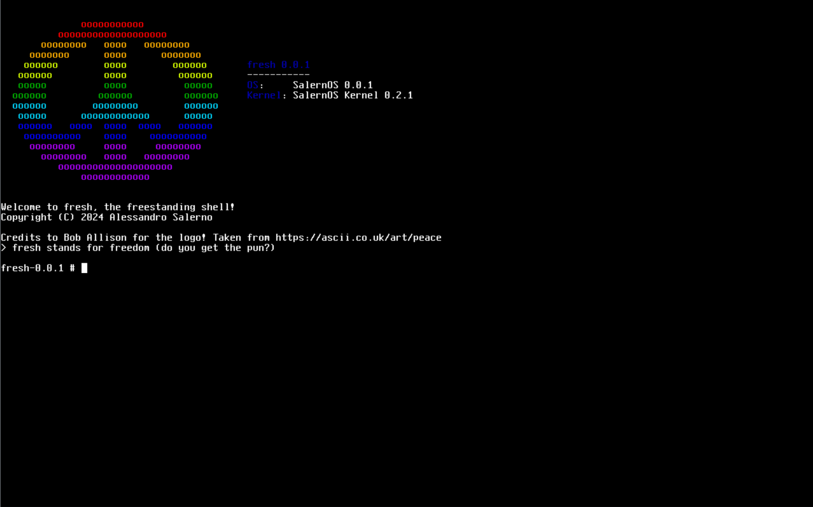

    <h1 align="center">fresh</h1>
    
 The freestanding shell 

[contributors-shield]: https://img.shields.io/github/contributors/Alessandro-Salerno/fresh.svg?style=flat-square
[contributors-url]: https://github.com/Alessandro-Salerno/fresh/graphs/contributors
[forks-shield]: https://img.shields.io/github/forks/Alessandro-Salerno/fresh.svg?style=flat-square
[forks-url]: https://github.com/Alessandro-Salerno/fresh/network/members
[stars-shield]: https://img.shields.io/github/stars/Alessandro-Salerno/fresh.svg?style=flat-square
[stars-url]: https://github.com/Alessandro-Salerno/fresh/stargazers
[issues-shield]: https://img.shields.io/github/issues/Alessandro-Salerno/fresh.svg?style=flat-square
[issues-url]: https://github.com/Alessandro-Salerno/fresh/issues
[license-shield]: https://img.shields.io/github/license/Alessandro-Salerno/fresh.svg?style=flat-square
[license-url]: https://github.com/Alessandro-Salerno/fresh/blob/master/LICENSE.txt

[![Contributors][contributors-shield]][contributors-url]
[![Forks][forks-shield]][forks-url]
[![Stargazers][stars-shield]][stars-url]
[![Issues][issues-shield]][issues-url]
[![MIT License][license-shield]][license-url]

  
  
fresh running on <a href="https://github.com/Alessandro-Salerno/SalernOS-Kernel">SalernOS</a></h1>

## What is fresh?
`fresh` is a work-in-progress commandline shell for SalernOS designed to be easily portable to other Unix-like operating systems.

## What's special?
The "fre" in `fresh` stands for "freestanding", this means that `fresh` is 100% self-contained and requires no fancy OS features (e.g., dynamic linking, libc, etc.). The executable is statically linked, and the C Runtime Environment is implemented directly in the main source tree.

## State
Currently, `fresh` only has partial support for SalernOS Kernel 0.2.1.

## License
`fresh`, and all other "original" subprojects are distributed under the MIT license. See LICENSE for details.

This repository, however, contains several subprojects which may be redistributions of free and open source software authored by third parties. Credit and licenses for these modules are included in the relevant source files.
